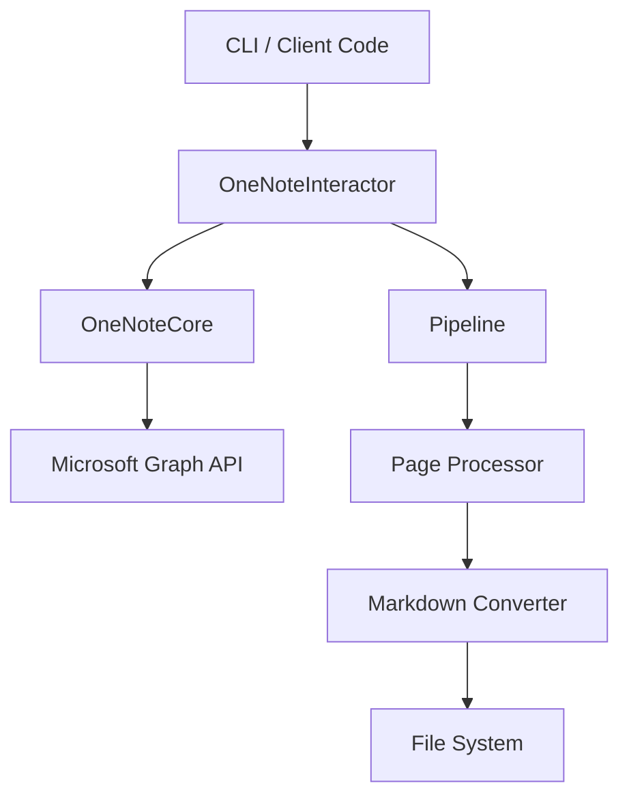
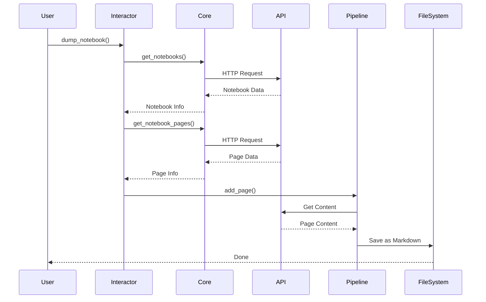

# onenote-dump

A utility for converting a Microsoft OneNote notebook to markdown, with a clean architecture design for better extensibility.

## Features

- Convert OneNote notebooks to markdown format
- Compatible with [Notable](https://github.com/notable/notable)
  - Markdown with metadata headers
  - `@attachment` syntax for attachments
  - `@note` syntax for note links
- Microsoft Graph API integration
- Concurrent processing with pipeline architecture
- Type-safe with full type hints
- Both CLI and programmatic usage
- MCP server mode for programmatic interaction via [FastMCP](https://github.com/windsurf-ai/fastmcp)

## Project Structure

```
onenote_dump/
├── core.py         # Core API operations
├── interactor.py   # High-level interface
├── main.py         # CLI entry point
├── onenote.py      # OneNote API client
├── onenote_auth.py # Authentication
└── pipeline.py     # Concurrent processing
```

## Architecture



### Components

- **OneNoteInteractor**: 高级接口层，提供友好的API
  - 处理参数验证和类型转换
  - 提供直观的方法名和参数
  - 返回结构化的结果

- **OneNoteCore**: 核心API操作层
  - 处理与Microsoft Graph API的通信
  - 管理认证和会话
  - 提供底层API调用

- **Pipeline**: 并发处理层
  - 使用线程池处理页面转换
  - 实现异步IO操作
  - 管理资源和错误处理

## Data Flow



## Installation

### Requirements
- Python 3.6+
- Microsoft Account with OneNote access

### Using pip

1. Create a virtual environment:
```bash
python -m venv .venv
```

2. Activate the environment:
```bash
# On Windows
.venv\Scripts\activate.bat

# On macOS/Linux
source .venv/bin/activate
```

3. Install dependencies:
```bash
# For basic usage
pip install -r requirements.txt

# For development (includes type hints)
pip install -r requirements.txt -r requirements-dev.txt
```

### Using Poetry

```bash
poetry install
```

## Authentication

This utility uses OAuth 2.0 to authenticate with the Microsoft Graph API. The first time you run a command that requires API access (e.g., `list` or `dump`), your web browser will open, prompting you to log in with your Microsoft account and grant permissions to the application.

Key points about authentication:

- **One-Time Setup**: After successful authentication, an access token (and refresh token) is saved locally (typically at `~/.onenote-dump-token`). Subsequent runs will use this saved token until it expires, at which point you may be prompted to re-authenticate.
- **Redirect URI**: The application listens on `http://localhost:8000/auth` for the authentication redirect from Microsoft. This URI must be configured as a 'Mobile and desktop applications' redirect URI in your Azure AD application registration if you are using your own.
- **Client ID**: The `CLIENT_ID` for the Azure AD application is hardcoded in `onenote_dump/onenote_auth.py`. If you wish to use your own Azure AD application, you'll need to replace this `CLIENT_ID` with your own.
- **`OAUTHLIB_INSECURE_TRANSPORT`**: Due to `oauthlib`'s strict HTTPS requirements and the use of `http://localhost` for the redirect URI (standard for local desktop apps), you **MUST** set the environment variable `OAUTHLIB_INSECURE_TRANSPORT='1'` when running commands that initiate or refresh authentication. This tells `oauthlib` to allow the HTTP redirect URI for localhost. This does not compromise the security of the token exchange with Microsoft, which always occurs over HTTPS.

Example of setting the environment variable for a command:
`OAUTHLIB_INSECURE_TRANSPORT='1' python -m onenote_dump.main list`

## Usage

### Command Line Interface

**Important**: When running commands that might trigger authentication (first run, expired token, or using `--new-session`), prefix your command with `OAUTHLIB_INSECURE_TRANSPORT='1'` as shown below.

```bash
# List available notebooks (authentication may be triggered)
OAUTHLIB_INSECURE_TRANSPORT='1' python -m onenote_dump.main list

# Example: dump specific notebook to default 'output' directory (authentication may be triggered)
OAUTHLIB_INSECURE_TRANSPORT='1' python -m onenote_dump.main dump "Work Notes"

# Example: dump specific notebook to a specified directory
OAUTHLIB_INSECURE_TRANSPORT='1' python -m onenote_dump.main --output-dir ./my_work_notes dump "Work Notes"

# Example: dump specific section with verbose output
OAUTHLIB_INSECURE_TRANSPORT='1' python -m onenote_dump.main -v --output-dir ./output dump "Work Notes" --section-name "Projects"

# Example: limit number of pages
OAUTHLIB_INSECURE_TRANSPORT='1' python -m onenote_dump.main --output-dir ./output --max-pages 10 dump "Work Notes"

# Example: start from specific page
OAUTHLIB_INSECURE_TRANSPORT='1' python -m onenote_dump.main --output-dir ./output --start-page 5 dump "Work Notes"

# Run as an MCP server (see MCP Server Mode section below)
# Authentication will be handled when MCP tools requiring it are called.
# Ensure the environment running the MCP server has OAUTHLIB_INSECURE_TRANSPORT='1' set if needed.
python -m onenote_dump.main --mcp
```

### As a Library

```python
from onenote_dump.interactor import OneNoteInteractor

# Initialize the interactor
interactor = OneNoteInteractor(verbose=True)

# List all notebooks
notebooks = interactor.list_notebooks()
for notebook in notebooks:
    print(f"Found notebook: {notebook['displayName']}")

# Dump a specific notebook
result = interactor.dump_notebook(
    notebook_name="Work Notes",
    output_dir="./output",
    section_name="Projects",  # Optional: specific section
    max_pages=100,          # Optional: limit pages
    start_page=1,           # Optional: start page
    new_session=False       # Optional: force new auth session
)

# Check results
print(f"Exported {result['total_pages']} pages in {result['duration_seconds']:.1f} seconds")
print(f"Output directory: {result['output_path']}")

# Optional: force new auth session
# Note: If authentication is triggered (e.g. new_session=True or no valid token),
# ensure the environment has OAUTHLIB_INSECURE_TRANSPORT='1' set.
result = interactor.dump_notebook(
    notebook_name="Work Notes",
    output_dir="./output",
    section_name="Projects",  # Optional: specific section
    max_pages=100,          # Optional: limit pages
    start_page=1,           # Optional: start page
    new_session=True        # Optional: force new auth session
)
```

### MCP Server Mode

The utility can run as an MCP (Model Context Protocol) server, allowing it to be controlled programmatically by MCP clients. This mode uses [FastMCP](https://github.com/windsurf-ai/fastmcp) and communicates over stdio.

To start the server:
```bash
python -m onenote_dump.main --mcp
```
The server will then listen for JSON-RPC 2.0 messages on standard input and send responses to standard output.

#### Available MCP Tools

**1. `list_notebooks_mcp`**

- **Description**: List available OneNote notebooks.
- **Parameters**:
  - `new_session` (boolean, optional, default: `False`): If `True`, ignore any saved session and force re-authentication.
- **Returns**: (array of objects) A list of notebook objects, where each object contains details like `id` and `displayName`.
  Example: `[{"id": "notebook_id_1", "displayName": "My Notebook"}, ...]`

**2. `dump_notebook_mcp`**

- **Description**: Dump a OneNote notebook to markdown.
- **Parameters**:
  - `args` (object): An object containing the arguments for the dump operation.
    - `notebook_name` (string, required): The name of the notebook to dump.
    - `output_dir` (string, required): The directory where the notebook content will be saved.
    - `section_name` (string, optional, default: `None`): The name of a specific section to dump. If `None`, all sections are dumped.
    - `max_pages` (integer, optional, default: `None`): Maximum number of pages to dump per section. If `None`, all pages are dumped.
    - `start_page` (integer, optional, default: `None`): Page number (1-indexed) to start dumping from. If `None`, starts from the first page.
    - `new_session` (boolean, optional, default: `False`): If `True`, ignore any saved session and force re-authentication.
- **Returns**: (object) An object containing the status of the dump operation.
  Example: `{"status": "success", "path": "./output/My Notebook", "total_pages": 50, "duration_seconds": 120.5}` (Note: actual fields in result may vary based on `OneNoteInteractor.dump_notebook` return)

### Poetry Users

If you're using Poetry, you can use the `onenote-dump` binary:
created with `poetry install` instead of `python onenote_dump/main.py`.

For full usage details:

```
onenote-dump --help
```

When run, the script will launch a browser window so that you can authorize the
script to access your OneNote data. Subsequent runs won't require this, so long
as the authorization token is good (about an hour). If you want to force
re-authentication, you can pass the "--new-session" param.

The output directory and parents will be created if needed.

If your notebook is large, there is a good chance you'll hit the request rate
limit on Microsoft's API, which will cause the script to wait for a few minutes
and try again. You may wish to kill the program (Ctrl+C) and use the
`--start-page` option some time later, or the `--section` option to select a
subset of a notebook.

If you're happy with the output, you can copy it to your Notable notes
directory.

## Development

### Setup Development Environment

```bash
# Clone the repository
git clone https://github.com/istarwyh/onenote-dump.git
cd onenote-dump

# Create virtual environment
python -m venv .venv
source .venv/bin/activate  # or .venv\Scripts\activate.bat on Windows

# Install dependencies including development tools
pip install -r requirements.txt -r requirements-dev.txt
```

### Project Design

1. **Clean Architecture**
   - Separation of concerns with clear layers
   - Dependency injection for better testability
   - Clear boundaries between components

2. **Type Safety**
   - Full type hints coverage
   - Mypy for static type checking
   - Runtime type validation

3. **Concurrent Processing**
   - Thread pool for IO operations
   - Pipeline pattern for data processing
   - Resource management

4. **Error Handling**
   - Structured error types
   - Graceful degradation
   - Detailed error messages

### Contributing

1. Fork the repository
2. Create your feature branch (`git checkout -b feature/amazing-feature`)
3. Commit your changes (`git commit -m 'feat: add amazing feature'`)
4. Push to the branch (`git push origin feature/amazing-feature`)
5. Open a Pull Request

#### Commit Message Format

We follow the [Conventional Commits](https://www.conventionalcommits.org/) specification:

- `feat`: New feature
- `fix`: Bug fix
- `refactor`: Code change that neither fixes a bug nor adds a feature
- `docs`: Documentation only changes
- `test`: Adding missing tests or correcting existing tests
- `chore`: Changes to the build process or auxiliary tools

Example:
```
feat: add notebook search functionality
fix: handle API rate limiting correctly
docs: update installation instructions
